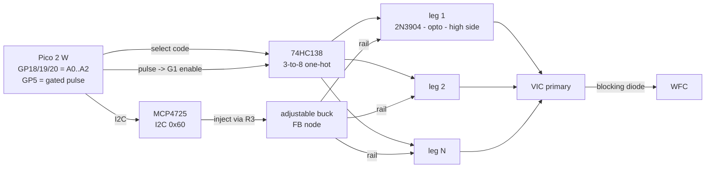

# Amplitude sequencing for the VIC drive

Two independent mechanisms, because no single one covers both timescales:

| | mechanism | timescale | resolution |
|---|---|---|---|
| **A** | tap select — one-hot decoder picking among N drive legs | **per pulse** | 7 discrete levels |
| **B** | programmable rail — DAC into the buck's feedback node | **slow envelope** | 12-bit continuous |

They compose: B sets where the ceiling sits over a run, A steps between taps
inside a burst.

Schematics here are ASCII rather than Mermaid on purpose — Mermaid draws graphs,
not circuits, and it cannot express a divider node or a current path. The
Mermaid block below is signal flow only.



---

## A. Per-pulse tap select

The firmware side is **already done and flashed**. The elongation state machine
drives a 3-bit code on GP18/19/20 out of the same DMA stream that carries the
pulse widths, so "which pulse" and "which tap" cannot drift apart. The code for
pulse *i+1* is emitted at the **start** of pulse *i*'s low phase, so it has the
whole of T2 to settle before the next edge.

```
                    +3V3
                      |
 GP18 ──── A0        [R] 4k7 (x3, only if long runs)
 GP19 ──── A1         |
 GP20 ──── A2    ┌────┴──────────┐
                 │   74HC138     │
 GP5  ──── G1    │  3-to-8 dec.  │  Y0 ── (leave unconnected: code 0 = all off)
 GND  ──── /G2A  │               │  Y1 ── leg 1
 GND  ──── /G2B  └───────────────┘  Y2 ── leg 2
                                    Y3 ── leg 3
                                    ...
```

**Y0 must be left unconnected.** The firmware pushes code 0 to park the decoder
between bursts and on stop; that only means "deselected" if nothing is wired to
Y0.

**G1 is the pulse itself.** The address says *which* leg, the gated output (GP5)
says *when*. That gives break-before-make for free: the address only ever
changes while G1 is low.

One leg, repeated per level:

```
  Yn ──[1k]──┬── B  2N3904          Vrail (from the buck, section B)
             │      C ──┬──[330R]──── LED+ ┐              │
            [10k]       │                  │ H11D1        │
             │          └──────────────────┘  (or fast    │
            GND                                 opto)     │
                                        phototransistor   │
                                          C ──────────────┤
                                          E ──[1k]── base of high-side
                                                           │
                                                    high-side device
                                                           │
                                                     ──────┴──── MUR diode ──> VIC primary
```

### Speed ceiling — read this before wiring eight of them

The **H11D1 is the limit**, not the decoder. It is a phototransistor output:
turn-on is microseconds and turn-off is worse, because nothing actively pulls
the base down. Your BJT high-side adds storage time on top.

- **At kHz rates with tens of µs of T2** — fine. The address changes at the
  start of the gap and has the whole gap to settle.
- **In the 1 µs step-charge regime** — it will not work. There is not enough
  gap to break, switch and make.

If you want per-pulse amplitude *and* microsecond pulses, the swap is a
gate-drive opto (FOD3182, HCPL-3120, ~200–500 ns) or a digital isolator plus
isolated bias (Si823x, ~50 ns), and a MOSFET or IGBT instead of the BJT.

### Why a decoder rather than three GPIOs

Two taps of one winding conducting simultaneously shorts the turns between
them — a dead short with only winding resistance in the loop. A one-hot decoder
makes that combination physically unreachable regardless of what the firmware
asks for. This is the whole reason the part is there.

### Driving it

```
SEQ 1,1,0  2,1,1  4,1,2  8,1,3      # t1_us,t2_us,amp — widening, climbing taps
SEQ                                  # print the loaded table
SEQ OFF                              # back to ELONGATE's geometric ratio
```

Up to 25 steps. Widths land on integer 6.67 ns PIO clocks, so what you ask for
is what comes out.

---

## B. Programmable rail (MCP4725)

The DAC does **not** go in the power path. It injects into the feedback node of
an adjustable buck, because every adjustable regulator does the same thing:
drive the output until FB equals its internal reference.

```
        V_out ──────┬───────────────────────► to the drive legs
                    │
                   [R1] 10k
                    │
     FB pin ────────┼──────────[R3] 3k65 ──────┬───── MCP4725 VOUT
                    │                          │
                   [R2] 887R                 [100nF]
                    │                          │
                   GND                        GND
```

The 100 nF sits on the **DAC side** of R3, never on FB itself — a cap directly
on FB is inside the regulator's control loop and will change its compensation,
which is how you turn a working buck into an oscillator.

### The maths

At regulation `V_fb = V_ref`, so summing currents into the FB node:

```
V_out = V_ref · (1 + R1/R2 + R1/R3)  −  V_dac · (R1/R3)
```

Two design equations fall straight out:

```
span     = V_dd · R1/R3                          (V_dd = 3.3 V)
ceiling  = V_ref · (1 + R1/R2 + R1/R3)           (at V_dac = 0)
```

**Worked example** — `V_ref = 0.8 V`, want 12 V down to 3 V:

| | value | standard part |
|---|---|---|
| R1 | 10 kΩ | 10 k 1% |
| R2 | 887 Ω | 887 R 1% (E96) |
| R3 | 3.667 kΩ | 3 k65 1% (E96) |

Check: ceiling = 0.8 × (1 + 11.274 + 2.740) = **12.01 V**, floor = 12.01 −
3.3 × 2.740 = **2.97 V**. Span 9.04 V over 12 bits = **2.2 mV per LSB**.

Retarget by picking your regulator's actual `V_ref` — 0.8 V is typical for
modern bucks (MP1584), but LM2596 is 1.23 V and XL4015 is 1.25 V. Using the
wrong one puts the whole range in the wrong place.

### Failure direction — the part that matters

**`V_dac = 0` gives MAXIMUM output.** That is backwards from what you want, and
there is no way around it with passive injection: less injected current means a
lower FB, which the regulator answers by raising V_out.

Two mitigations, use both:

1. **Store full-scale in the MCP4725's EEPROM.** It powers up at the stored
   code, not zero, so a cold boot comes up *attenuated*. This is the main reason
   to choose the MCP4725 over a digipot — a digipot's wiper is undefined at
   power-up.
2. **Let the fixed divider set the ceiling at the maximum the circuit is rated
   for.** Then the worst case — DAC dead at 0 — is "runs at full rated output",
   never *above* it. R1/R2 is your hardware limit; the DAC only pulls down from
   it.

If the DAC loses power entirely its output goes high-Z, injection stops, and you
land on that same ceiling.

### The catch that decides what this is actually good for

Coming **up** the converter drives the output hard. Coming **down** it can only
bleed through the load and whatever is across `C_out`.

To drop 12 V → 3 V across 100 µF in a 1 ms mute you must remove
`Q = C·ΔV = 900 µC` in 1 ms — about **0.9 A of discharge**. You will not get
that at light load, and a passive bleeder sized for it would burn ~20 W
continuously.

An active discharge (small N-MOSFET + ~10 Ω across the output, gate from a spare
GPIO, fired only on a step *down*) does the job. The resistor eats
`½C(V₁²−V₂²)` = **6.8 mJ** per step-down — 0.07 W at 10 Hz and fine, **6.8 W at
1 kHz** and not fine.

**So B is a slow envelope control, not per-train amplitude.** Changing amplitude
every few hundred milliseconds across a run: yes. Changing it between bursts at
kHz: no — that is what A exists for.

### Wiring

| MCP4725 | to |
|---|---|
| VDD | 3V3 |
| GND | GND |
| SDA | GP0 |
| SCL | GP1 |
| A0 | GND (addr 0x60) or 3V3 (0x61) |
| VOUT | R3 → FB node |

I²C shares GP0/GP1 with the planned SSD1306 (0x3C) — no address conflict. One
pair of 4k7 pull-ups to 3V3 for the whole bus.

---

## Parts

### A — per-pulse tap select, 4 levels

| Qty | Part | Notes |
|---|---|---|
| 1 | 74HC138 (or 74HCT138) | 3-to-8 one-hot decoder. **The interlock.** |
| 4 | 2N3904 | opto LED driver — you already use these |
| 4 | H11D1 | what you have. See the speed ceiling above |
| 4 | high-side device | 2N6676, or MOSFET/IGBT if you want speed |
| 4 | MUR-series diode | blocking, one per leg |
| 4 | 1 kΩ | 2N3904 base |
| 4 | 10 kΩ | 2N3904 base pull-down |
| 4 | 330 Ω | opto LED current limit (size for your rail) |
| 4 | 1 kΩ | high-side base drive |
| 1 | 100 nF | 74HC138 decoupling, at the pin |

Optional, for microsecond pulses: swap the 4 × H11D1 for **FOD3182** or
**HCPL-3120**, and the high-side BJTs for logic-level MOSFETs or IGBTs.

Scales to 7 levels by repeating the leg — the decoder already has the outputs.

### B — programmable rail

| Qty | Part | Notes |
|---|---|---|
| 1 | **MCP4725A0T-E/CH** | 12-bit I²C DAC, EEPROM power-on default |
| 1 | adjustable buck | note its `V_ref` before picking resistors |
| 1 | 10 kΩ 1% | R1 |
| 1 | 887 Ω 1% | R2 — sets the ceiling with R1 |
| 1 | 3.65 kΩ 1% | R3 — sets the span |
| 1 | 100 nF | DAC-side filter, **not** on FB |
| 2 | 4.7 kΩ | I²C pull-ups (shared with the OLED) |
| 1 | 100 nF | MCP4725 decoupling |

Optional active discharge: 1 × logic-level N-MOSFET (2N7002 for small loads,
IRLZ44N for real current), 1 × 10 Ω power resistor, 1 × 100 kΩ gate pull-down.

### Step 1 — nothing

The arbitrary per-pulse envelope is firmware only and is already flashed. It
drives the select lane above, but with nothing wired to GP18/19/20 those pins
just toggle into open air and the widths still sequence.

---

## Pin budget after both

| Pin | Use |
|---|---|
| GP18/19/20 | tap select A0/A1/A2 |
| GP0/GP1 | I²C — MCP4725 + OLED |
| GP21 | free — active-discharge gate |
| GP22, GP26–28 | free (26–28 are the only ADC) |
